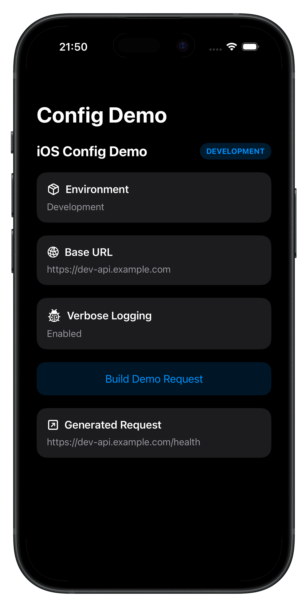
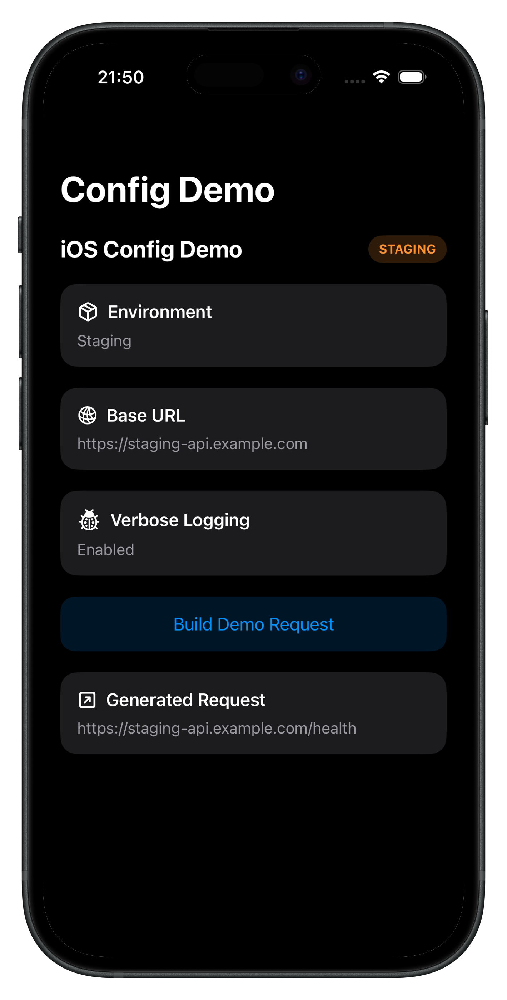
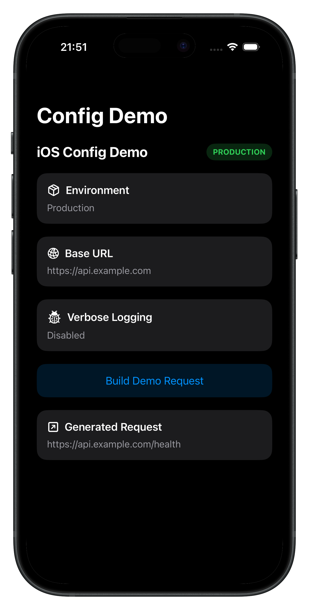

# iOS Environment Config Demo

A small SwiftUI demo showing how to manage **Development**, **Staging**, and **Production** environments using:

- `.xcconfig`
- `Info.plist`
- `Bundle.main`
- a strongly typed `AppConfig`

This project keeps environment values out of source code and shows a clean, scalable way to switch app configuration per build.

---

## Why this project exists

In many iOS projects, values like API base URLs, feature flags, and app display names end up hardcoded in Swift files or manually managed inside Xcode build settings.

This demo shows a cleaner approach:

- environment values live inside `.xcconfig` files
- `Info.plist` reads those values using `$(VARIABLE_NAME)`
- Swift code accesses them through a typed config layer

That makes the setup easier to scale and safer to maintain.

---

## Environments

### Development
- `https://dev-api.example.com`
- verbose logging enabled

### Staging
- `https://staging-api.example.com`
- verbose logging enabled

### Production
- `https://api.example.com`
- verbose logging disabled

---

## What the demo shows

- custom build configurations
- `.xcconfig` driven values
- `Info.plist` variable injection
- typed config access through `AppConfig`
- environment-aware request generation
- simple SwiftUI UI that displays the active environment

---

## Project structure

```text
iOSConfigDemo/
├── iOSConfigDemoApp.swift
├── ContentView.swift
├── Core/
│   ├── Config/
│   │   ├── AppConfig.swift
│   │   ├── Development.xcconfig
│   │   ├── Staging.xcconfig
│   │   └── Production.xcconfig
│   ├── Networking/
│   │   └── APIClient.swift
│   └── UI/
│       └── EnvironmentBadgeView.swift
└── Resources/
    └── Info.plist
```

---

## How it works

### 1. `.xcconfig` files define environment values

Each environment has its own config file.

Example:

```xcconfig
API_BASE_URL = https:/$()/staging-api.example.com
APP_ENVIRONMENT = staging
ENABLE_VERBOSE_LOGGING = YES
APP_DISPLAY_NAME = iOS Config Demo
```

---

### 2. `Info.plist` pulls values from build settings

```xml
<key>API_BASE_URL</key>
<string>$(API_BASE_URL)</string>

<key>APP_ENVIRONMENT</key>
<string>$(APP_ENVIRONMENT)</string>

<key>ENABLE_VERBOSE_LOGGING</key>
<string>$(ENABLE_VERBOSE_LOGGING)</string>
```

---

### 3. `AppConfig` reads them in Swift

```swift
enum AppEnvironment: String {
    case development
    case staging
    case production
}

enum AppConfig {
    static var environment: AppEnvironment {
        guard
            let value = Bundle.main.object(forInfoDictionaryKey: "APP_ENVIRONMENT") as? String,
            let env = AppEnvironment(rawValue: value.lowercased())
        else {
            fatalError("Missing or invalid APP_ENVIRONMENT in Info.plist")
        }
        return env
    }
}
```

---

## Running the demo

### 1. Create or select a scheme
Use a scheme that points to one of your custom build configurations.

### 2. Choose a build configuration

In Xcode:

- **Product**
- **Scheme**
- **Edit Scheme**
- **Run**
- choose **Development**, **Staging**, or **Production**

### 3. Run the app

The app UI will display:

- active environment
- active base URL
- logging status
- generated request URL

---

## Example output

```text
ENV: staging
URL: https://staging-api.example.com
🌍 ENV: staging
🔗 Request URL: https://staging-api.example.com/health
```

---

## Screenshots

<p float="left">
  
  
  
</p>

<p align="center">
  <sub>Development &nbsp;&nbsp;&nbsp;&nbsp;&nbsp;&nbsp;&nbsp;&nbsp; Staging &nbsp;&nbsp;&nbsp;&nbsp;&nbsp;&nbsp;&nbsp;&nbsp; Production</sub>
</p>

---

## How to add screenshots

### 1. Create a folder in your repo

```text
Screenshots
```

### 2. Add images

```text
Screenshots/
├── development.png
├── staging.png
└── production.png
```

### 3. Reference them in README

```md


```

---

## Why `.xcconfig` is useful

This pattern helps with:

- avoiding hardcoded URLs
- cleaner environment management
- safer staging vs production separation
- easier scaling when more config values are added
- better team visibility into environment setup

---

## Possible improvements

Future additions could include:

- separate app icons per environment
- different display names per environment
- feature flags
- analytics keys per environment
- unit tests for `AppConfig`
- a real API request instead of just generating a request URL

---

## License

This project is provided as a small educational demo for iOS environment configuration.
